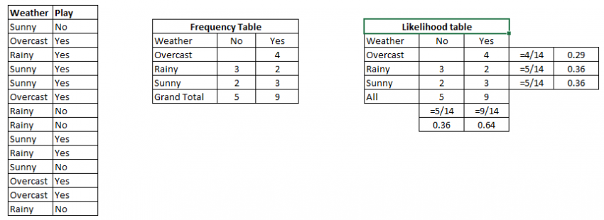

# MACHINE LEARNING ALGORITHMS FOR CLASSIFICATION PROBLEMS

This is a recopilation of supervised machine learning algorithms for classification problems and the implementation of those algoritmhs in python. This guide is based on ***analyticsvidhya*** (web page about machine learning). 

## 1. Logistic Regression

Don’t get confused by its name! It is a classification not a regression algorithm. It is used to estimate discrete values ( Binary values like 0/1, yes/no, true/false ) based on given set of independent variable(s). In simple words, it predicts the probability of occurrence of an event by fitting data to a logit function. Hence, it is also known as logit regression. Since, it predicts the probability, its output values lies between 0 and 1 (as expected).

Again, let us try and understand this through a simple example.

Let’s say your friend gives you a puzzle to solve. There are only 2 outcome scenarios – either you solve it or you don’t. Now imagine, that you are being given wide range of puzzles / quizzes in an attempt to understand which subjects you are good at. The outcome to this study would be something like this – if you are given a trignometry based tenth grade problem, you are 70% likely to solve it. On the other hand, if it is grade fifth history question, the probability of getting an answer is only 30%. This is what Logistic Regression provides you.

Coming to the math, the log odds of the outcome is modeled as a linear combination of the predictor variables.

```python
odds= p/ (1-p) = probability of event occurrence / probability of not event occurrence
ln(odds) = ln(p/(1-p))
logit(p) = ln(p/(1-p)) = b0+b1X1+b2X2+b3X3....+bkXk
```

Above, p is the probability of presence of the characteristic of interest. It chooses parameters that maximize the likelihood of observing the sample values rather than that minimize the sum of squared errors (like in ordinary regression).

Now, you may ask, why take a log? For the sake of simplicity, let’s just say that this is one of the best mathematical way to replicate a step function. I can go in more details, but that will beat the purpose of this article.


```python
#Import Library
from sklearn.linear_model import LogisticRegression
#Assumed you have, X (predictor) and Y (target) for training data set and x_test(predictor) of test_dataset
# Create logistic regression object
model = LogisticRegression()
# Train the model using the training sets and check score
model.fit(X, y)
model.score(X, y)
#Equation coefficient and Intercept
print('Coefficient: \n', model.coef_)
print('Intercept: \n', model.intercept_)
#Predict Output
predicted= model.predict(x_test)
```

## 2. Decision Tree

This is one of my favorite algorithm and I use it quite frequently. It is a type of supervised learning algorithm that is mostly used for classification problems. Surprisingly, it works for both categorical and continuous dependent variables. In this algorithm, we split the population into two or more homogeneous sets. This is done based on most significant attributes/ independent variables to make as distinct groups as possible. For more details, you can read: Decision Tree Simplified.


In the image above, you can see that population is classified into four different groups based on multiple attributes to identify ‘if they will play or not’. To split the population into different heterogeneous groups, it uses various techniques like Gini, Information Gain, Chi-square, entropy.

The best way to understand how decision tree works, is to play Jezzball – a classic game from Microsoft (image below). Essentially, you have a room with moving walls and you need to create walls such that maximum area gets cleared off with out the balls.


So, every time you split the room with a wall, you are trying to create 2 different populations with in the same room. Decision trees work in very similar fashion by dividing a population in as different groups as possible.

```python
#Import Library
#Import other necessary libraries like pandas, numpy...
from sklearn import tree
#Assumed you have, X (predictor) and Y (target) for training data set and x_test(predictor) of test_dataset
# Create tree object 
model = tree.DecisionTreeClassifier(criterion='gini') # for classification, here you can change the algorithm as gini or entropy (information gain) by default it is gini  
# model = tree.DecisionTreeRegressor() for regression
# Train the model using the training sets and check score
model.fit(X, y)
model.score(X, y)
#Predict Output
predicted= model.predict(x_test)
```

## 3. SVM (Support Vector Machine)

It is a classification method. In this algorithm, we plot each data item as a point in n-dimensional space (where n is number of features you have) with the value of each feature being the value of a particular coordinate.

For example, if we only had two features like Height and Hair length of an individual, we’d first plot these two variables in two dimensional space where each point has two co-ordinates (these co-ordinates are known as Support Vectors)


Now, we will find some line that splits the data between the two differently classified groups of data. This will be the line such that the distances from the closest point in each of the two groups will be farthest away.


In the example shown above, the line which splits the data into two differently classified groups is the black line, since the two closest points are the farthest apart from the line. This line is our classifier. Then, depending on where the testing data lands on either side of the line, that’s what class we can classify the new data as.

Think of this algorithm as playing JezzBall in n-dimensional space. The tweaks in the game are:

You can draw lines / planes at any angles (rather than just horizontal or vertical as in classic game)
The objective of the game is to segregate balls of different colors in different rooms.
And the balls are not moving.

```python
#Import Library
from sklearn import svm
#Assumed you have, X (predictor) and Y (target) for training data set and x_test(predictor) of test_dataset
# Create SVM classification object 
model = svm.svc() # there is various option associated with it, this is simple for classification. You can refer link, for mo# re detail.
# Train the model using the training sets and check score
model.fit(X, y)
model.score(X, y)
#Predict Output
predicted= model.predict(x_test)
```

## 4. Naive Bayes

It is a classification technique based on Bayes’ theorem with an assumption of independence between predictors. In simple terms, a Naive Bayes classifier assumes that the presence of a particular feature in a class is unrelated to the presence of any other feature. For example, a fruit may be considered to be an apple if it is red, round, and about 3 inches in diameter. Even if these features depend on each other or upon the existence of the other features, a naive Bayes classifier would consider all of these properties to independently contribute to the probability that this fruit is an apple.

Naive Bayesian model is easy to build and particularly useful for very large data sets. Along with simplicity, Naive Bayes is known to outperform even highly sophisticated classification methods.

Bayes theorem provides a way of calculating posterior probability P(c|x) from P(c), P(x) and P(x|c). Look at the equation below:


Here,

- P(c|x) is the posterior probability of class (target) given predictor (attribute). 
- P(c) is the prior probability of class. 
- P(x|c) is the likelihood which is the probability of predictor given class. 
- P(x) is the prior probability of predictor.

Example: Let’s understand it using an example. Below I have a training data set of weather and corresponding target variable ‘Play’. Now, we need to classify whether players will play or not based on weather condition. Let’s follow the below steps to perform it.

Step 1: Convert the data set to frequency table

Step 2: Create Likelihood table by finding the probabilities like Overcast probability = 0.29 and probability of playing is 0.64.



Step 3: Now, use Naive Bayesian equation to calculate the posterior probability for each class. The class with the highest posterior probability is the outcome of prediction.

Problem: Players will pay if weather is sunny, is this statement is correct?

We can solve it using above discussed method, so P(Yes | Sunny) = P( Sunny | Yes) * P(Yes) / P (Sunny)

Here we have P (Sunny |Yes) = 3/9 = 0.33, P(Sunny) = 5/14 = 0.36, P( Yes)= 9/14 = 0.64

Now, P (Yes | Sunny) = 0.33 * 0.64 / 0.36 = 0.60, which has higher probability.

Naive Bayes uses a similar method to predict the probability of different class based on various attributes. This algorithm is mostly used in text classification and with problems having multiple classes.

```python
#Import Library
from sklearn.naive_bayes import GaussianNB
#Assumed you have, X (predictor) and Y (target) for training data set and x_test(predictor) of test_dataset
# Create SVM classification object model = GaussianNB() # there is other distribution for multinomial classes like Bernoulli Naive Bayes, Refer link
# Train the model using the training sets and check score
model.fit(X, y)
#Predict Output
predicted= model.predict(x_test)
```

## 5. KNN (K- Nearest Neighbors)

It can be used for both classification and regression problems. However, it is more widely used in classification problems in the industry. K nearest neighbors is a simple algorithm that stores all available cases and classifies new cases by a majority vote of its k neighbors. The case being assigned to the class is most common amongst its K nearest neighbors measured by a distance function.

These distance functions can be Euclidean, Manhattan, Minkowski and Hamming distance. First three functions are used for continuous function and fourth one (Hamming) for categorical variables. If K = 1, then the case is simply assigned to the class of its nearest neighbor. At times, choosing K turns out to be a challenge while performing KNN modeling.


KNN can easily be mapped to our real lives. If you want to learn about a person, of whom you have no information, you might like to find out about his close friends and the circles he moves in and gain access to his/her information!

Things to consider before selecting KNN:

- KNN is computationally expensive
- Variables should be normalized else higher range variables can bias it
- Works on pre-processing stage more before going for KNN like outlier, noise removal

```python
#Import Library
from sklearn.neighbors import KNeighborsClassifier
#Assumed you have, X (predictor) and Y (target) for training data set and x_test(predictor) of test_dataset
# Create KNeighbors classifier object model 
KNeighborsClassifier(n_neighbors=6) # default value for n_neighbors is 5
# Train the model using the training sets and check score
model.fit(X, y)
#Predict Output
predicted= model.predict(x_test)
```

## 6. Random Forest

Random Forest is a trademark term for an ensemble of decision trees. In Random Forest, we’ve collection of decision trees (so known as “Forest”). To classify a new object based on attributes, each tree gives a classification and we say the tree “votes” for that class. The forest chooses the classification having the most votes (over all the trees in the forest).

Each tree is planted & grown as follows:

1. If the number of cases in the training set is N, then sample of N cases is taken at random but with replacement. This sample will be the training set for growing the tree.
2. If there are M input variables, a number m<<M is specified such that at each node, m variables are selected at random out of the M and the best split on these m is used to split the node. The value of m is held constant during the forest growing.
3. Each tree is grown to the largest extent possible. There is no pruning.

```python
#Import Library
from sklearn.ensemble import RandomForestClassifier
#Assumed you have, X (predictor) and Y (target) for training data set and x_test(predictor) of test_dataset
# Create Random Forest object
model= RandomForestClassifier()
# Train the model using the training sets and check score
model.fit(X, y)
#Predict Output
predicted= model.predict(x_test)
```

## 7. Gradient Boosting Algorithms

## 7.1. GBM

GBM is a boosting algorithm used when we deal with plenty of data to make a prediction with high prediction power. Boosting is actually an ensemble of learning algorithms which combines the prediction of several base estimators in order to improve robustness over a single estimator. It combines multiple weak or average predictors to a build strong predictor. These boosting algorithms always work well in data science competitions like Kaggle, AV Hackathon, CrowdAnalytix.

```python
#Import Library
from sklearn.ensemble import GradientBoostingClassifier
#Assumed you have, X (predictor) and Y (target) for training data set and x_test(predictor) of test_dataset
# Create Gradient Boosting Classifier object
model= GradientBoostingClassifier(n_estimators=100, learning_rate=1.0, max_depth=1, random_state=0)
# Train the model using the training sets and check score
model.fit(X, y)
#Predict Output
predicted= model.predict(x_test)
```

## 7.2. XGBoost

Another classic gradient boosting algorithm that’s known to be the decisive choice between winning and losing in some Kaggle competitions.

The XGBoost has an immensely high predictive power which makes it the best choice for accuracy in events as it possesses both linear model and the tree learning algorithm, making the algorithm almost 10x faster than existing gradient booster techniques.

The support includes various objective functions, including regression, classification and ranking.

One of the most interesting things about the XGBoost is that it is also called a regularized boosting technique. This helps to reduce overfit modelling and has a massive support for a range of languages such as Scala, Java, R, Python, Julia and C++.

Supports distributed and widespread training on many machines that encompass GCE, AWS, Azure and Yarn clusters. XGBoost can also be integrated with Spark, Flink and other cloud dataflow systems with a built in cross validation at each iteration of the boosting process.

```python
from xgboost import XGBClassifier
from sklearn.model_selection import train_test_split
from sklearn.metrics import accuracy_score
X = dataset[:,0:10]
Y = dataset[:,10:]
seed = 1

X_train, X_test, y_train, y_test = train_test_split(X, Y, test_size=0.33, random_state=seed)

model = XGBClassifier()

model.fit(X_train, y_train)

#Make predictions for test data
y_pred = model.predict(X_test)

```

## 7.3. LightGBM

LightGBM is a gradient boosting framework that uses tree based learning algorithms. It is designed to be distributed and efficient with the following advantages:

Faster training speed and higher efficiency
Lower memory usage
Better accuracy
Parallel and GPU learning supported
Capable of handling large-scale data
The framework is a fast and high-performance gradient boosting one based on decision tree algorithms, used for ranking, classification and many other machine learning tasks. It was developed under the Distributed Machine Learning Toolkit Project of Microsoft.

Since the LightGBM is based on decision tree algorithms, it splits the tree leaf wise with the best fit whereas other boosting algorithms split the tree depth wise or level wise rather than leaf-wise. So when growing on the same leaf in Light GBM, the leaf-wise algorithm can reduce more loss than the level-wise algorithm and hence results in much better accuracy which can rarely be achieved by any of the existing boosting algorithms.

Also, it is surprisingly very fast, hence the word ‘Light’.

```python 
data = np.random.rand(500, 10) # 500 entities, each contains 10 features
label = np.random.randint(2, size=500) # binary target

train_data = lgb.Dataset(data, label=label)
test_data = train_data.create_valid('test.svm')

param = {'num_leaves':31, 'num_trees':100, 'objective':'binary'}
param['metric'] = 'auc'

num_round = 10
bst = lgb.train(param, train_data, num_round, valid_sets=[test_data])

bst.save_model('model.txt')

# 7 entities, each contains 10 features
data = np.random.rand(7, 10)
ypred = bst.predict(data)
```

## 7.4. Catboost

CatBoost is a recently open-sourced machine learning algorithm from Yandex. It can easily integrate with deep learning frameworks like Google’s TensorFlow and Apple’s Core ML.

The best part about CatBoost is that it does not require extensive data training like other ML models, and can work on a variety of data formats; not undermining how robust it can be.

Make sure you handle missing data well before you proceed with the implementation.

Catboost can automatically deal with categorical variables without showing the type conversion error, which helps you to focus on tuning your model better rather than sorting out trivial errors.

```python
import pandas as pd
import numpy as np

from catboost import CatBoostRegressor

#Read training and testing files
train = pd.read_csv("train.csv")
test = pd.read_csv("test.csv")

#Imputing missing values for both train and test
train.fillna(-999, inplace=True)
test.fillna(-999,inplace=True)

#Creating a training set for modeling and validation set to check model performance
X = train.drop(['Item_Outlet_Sales'], axis=1)
y = train.Item_Outlet_Sales

from sklearn.model_selection import train_test_split

X_train, X_validation, y_train, y_validation = train_test_split(X, y, train_size=0.7, random_state=1234)
categorical_features_indices = np.where(X.dtypes != np.float)[0]

#importing library and building model
from catboost import CatBoostRegressormodel=CatBoostRegressor(iterations=50, depth=3, learning_rate=0.1, loss_function='RMSE')

model.fit(X_train, y_train,cat_features=categorical_features_indices,eval_set=(X_validation, y_validation),plot=True)

submission = pd.DataFrame()

submission['Item_Identifier'] = test['Item_Identifier']
submission['Outlet_Identifier'] = test['Outlet_Identifier']
submission['Item_Outlet_Sales'] = model.predict(test)
```


